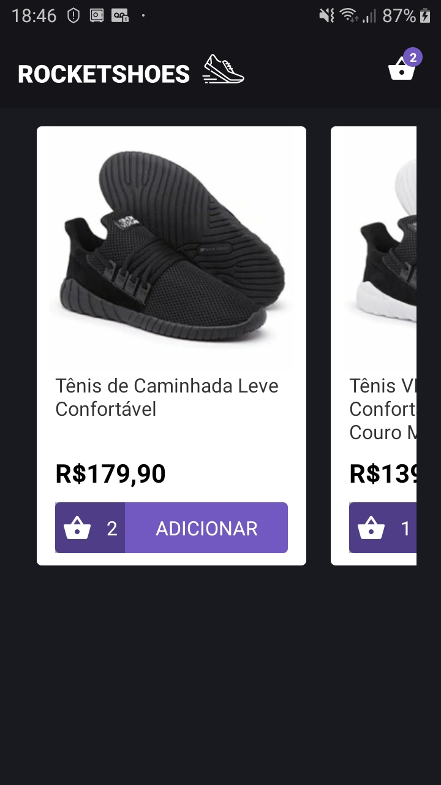
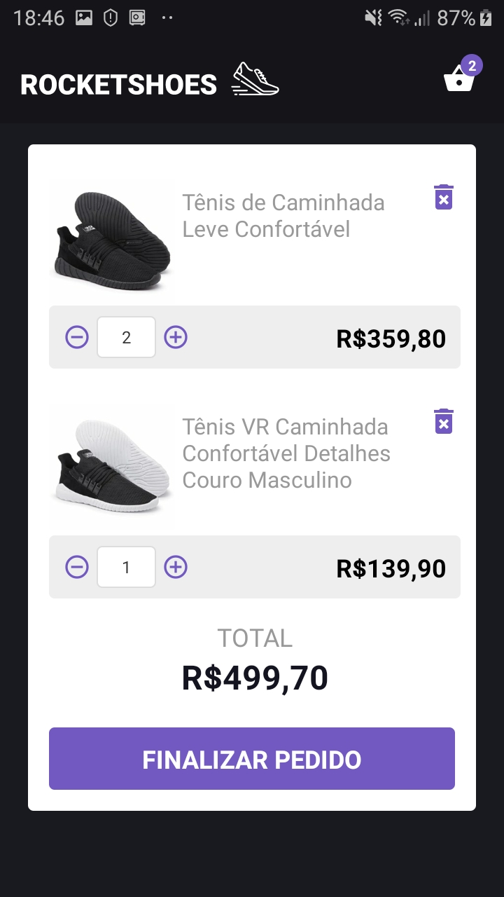
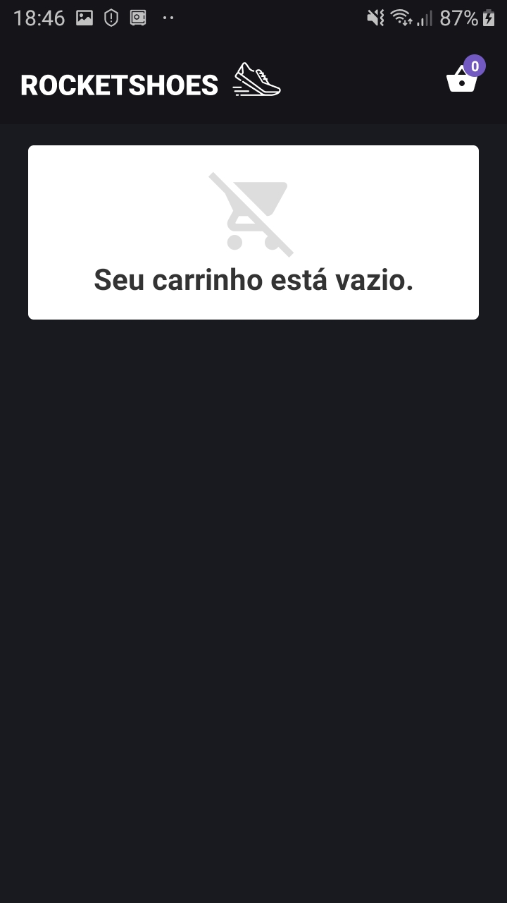
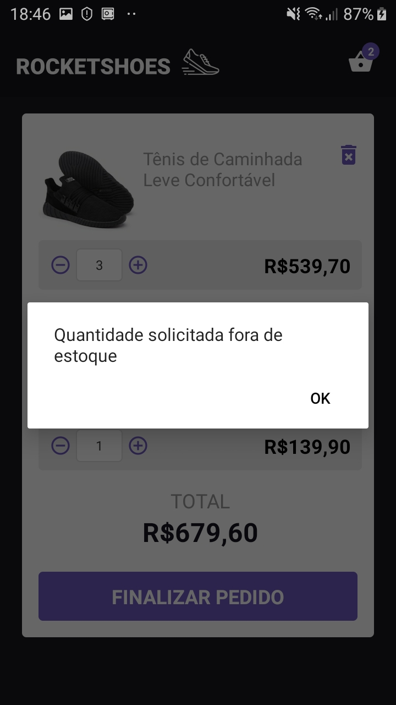

<h1 align="center">Bootcamp GoStack - RocketShoes Mobile :rocket:</h1>

<h2 align="center"> Desafio 7: Arquitetura Flux</h2>

<a href="https://github.com/Rocketseat/bootcamp-gostack-desafio-07">Detalhes do desafio</a>

<h2 align="center">Resultado do desafio</h2>

   

   

